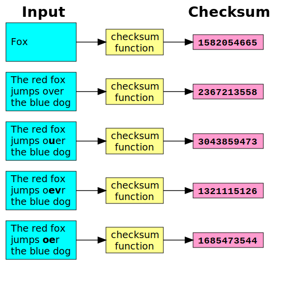

### প্রসংগ : সাইবার সিকিউরিটি

#### আর্টিকেল শুন্য দশমিক দুই

##### McCumber's Cube > CIA Triad > I (Integrity).

প্রারম্ভিক পোস্টে আমরা McCumber's Cube নিয়ে জেনেছি। সেখানে তিনটা প্রধান দিক নিয়ে আলোচনা করা হইছিলো। যার প্রতিটাতেই আবার ছিলো তিনটা করে কম্পোনেন্ট। তাইতো সেটা 3 x 3 কিউব...

আর পূর্বের পোস্টে আমরা গল্প করেছি McCumber's Cube এর প্রথম কম্পোনেন্ট Confidentiality নিয়ে। 

এবার তাহলে দ্বিতীয় কম্পোনেন্ট - Integrity নিয়ে একটু গল্প করি।

Integrity principle এর মূল কথা হলো - ডাটা যাতে কোনো অনাকাঙ্ক্ষিত মডিফিকেশন না হয় সেটা নিশ্চিত করা।

ধরা যাক, কিছু ডাটা খুব ভালোভাবে এনক্রিপ্ট করা আছে। এক্ষেত্রে সে ডাটা আনঅথরাইজড কেউ (কোনো মানুষ কিংবা কোনো সিস্টেম) জানতে পারতেসে না।

কিন্তু, তার মানে এই না যে, এই ডাটা ডিলেট/মডিফাই করা যাবে না।

ধরেন, আপনার ডাটা এনক্রিপ্টেড করা আছে। কিন্তু আপনার সেই এনক্রিপ্টেড ডাটা কেউ চাইলে ঠিকই ডিলেট করতে পারবে।

এনক্রিপশান তথ্যের গোপনীয়তা বজায় রাখতে কাজ করে। তাই বলে এটা তথ্যের বিশুদ্ধতা বা উপস্থিতি নিশ্চিত করে না।

এখন ইন্টিগ্রিটির নিশ্চিত করার জন্য বেশি ইউজ হওয়া একটা টেকনিক হলো Checksum.

এটা খুব কাজে লাগে যখন আপনি কোন একটা ফাইলে কোনো চেঞ্জ হয়েছে কি না - তা জানতে চান।

ধরেন, আপনার একটা ৫০০ পেজের বই আছে।
এখন আপনি এই বই টা কপি করলেন আপনার পিসি থেকে আপনার একটা পেনড্রাইভে। এখন আপনি নিশ্চিত হতে চাচ্ছেন যে, বইটা কোনো ধরনের মডিফিকেশন ছাড়াই ঠিকভাবে কপি হয়েছে।

এখন যদি আপনি পুরা বইটার ৫০০ পেজ জাস্ট একবার ঘেঁটেও দেখতে চান, এভাবে পুরো একটা বই না পড়ে শুধু চোখ বুলাতেও লাগবে অনেকখানি সময়।

আর ছোট্ট কোন একটা ওয়ার্ড বা লেটার কোথাও মিসিং আছে কি না সেটা তো চোখে দেখে ধরাটাও সহজে সম্ভব না।

অনেকে হয়তো বলবেন যে, প্রোপার্টিজ অপশান আছে না?

হ্যাঁ, প্রোপার্টিজ অপশান আছে এবং সেখানে আপনি ফাইলের সাইজ দেখতে পারবেন।

কিন্তু, একটা লেটারকে যদি অন্য আরেকটা লেটার দিয়ে রিপ্লেস করা হয়, বা ভুলে যদি দুইটা লেটার তার স্থান বিনিময় করে, সেক্ষেত্রে প্রোপার্টিজ অপশান তেমন একটা কাজে আসে না।

তো, সমাধান?

আছে, আছে। সমাধান আছে। 

এরকম ক্ষেত্রে Checksum একটা সহজ সমাধান হতে পারে।

নিচের ছবিটাতে দেখুন যে একটা লেটার মডিফাই / প্লেস চেঞ্জ / এড / ডিলেট করলে কেমন করে Checksum চেঞ্জ হয়ে যাচ্ছে।

আশা করি বিষয়টা ক্লিয়ার।

তবে একটা কথা বলে রাখা ভালো যে, Checksum ই কিন্তু ইন্টিগ্রিটি ম্যান্টেইন করার একমাত্র উপায় নয়। তবে এটা জাস্ট বেসিক।
